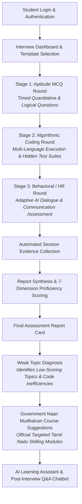

# Naan Mudhalvan Aligned Automated Technical Mock Interview Sandbox with Multi-Factor Coding Proficiency Metric Scoring

An enterprise-grade, automated technical assessment and mock interview ecosystem aligned with the Naan Mudhalvan initiative. The platform delivers end-to-end evaluation across quantitative aptitude, multi-language algorithmic coding with dynamic test-case execution, interactive behavioral/HR interviews, transparent multi-factor scoring metrics, and AI-driven evidence-based post-assessment learning assistance.

---

## 📌 Project Overview

This platform provides an automated, realistic technical mock interview environment designed to bridge the gap between academic preparation and industry hiring benchmarks. The system evaluates candidates across three progressive stages:

1. **Aptitude Assessment**: Timed domain-specific quantitative, logical, and verbal multiple-choice rounds with rich error-type diagnostics.
2. **Coding Assessment**: Multi-language code execution sandbox supporting **Python, C++, Java, C, and JavaScript**, evaluating code against sample and hidden test cases, custom inputs, execution time, and memory limits.
3. **Behavioral / HR Interview**: Adaptive AI-driven dialogue assessing communication, problem-solving mindset, and workplace readiness.
4. **Evidence-Based Assessment Reporting**: Transparent multi-factor competency evaluation synthesizing verified test metrics, complexity analysis, and behavioral transcripts into a 7-dimensional proficiency score.
5. **AI Learning Assistant & "Ask About My Interview" Chatbot**: Context-aware AI tutor providing step-by-step problem breakdowns, mistake diagnostics, concept revision, and interactive practice.
6. **Government Naan Mudhalvan Course Recommendation Engine**: Automated post-assessment alignment suggesting official Tamil Nadu Naan Mudhalvan skilling courses mapped directly to the candidate's diagnosed weak topics.
7. **Faculty & Administration Portal**: Comprehensive cohort monitoring, question bank authoring, candidate performance analytics, and custom template creation.

---

## 🚀 Key Features

### 1. Multi-Stage Interview Pipeline
- **Seamless Stage Transitions**: Candidates progress from Aptitude to Coding to HR interview with state persistence.
- **Stage Navigation & Timing**: Configurable stage timers, autosave mechanisms, and warning modals before auto-submission.

### 2. Multi-Language Coding Sandbox
- **Language Support**: Python 3, C++ (GCC), Java (OpenJDK), C (GCC), and JavaScript (Node.js).
- **Run vs. Submit Dual Pipeline**:
  - **RUN**: Executes code against visible sample test cases and custom user inputs with real-time stdout/stderr/compilation feedback.
  - **SUBMIT**: Evaluates code against hidden test suites to compute exact pass ratios, execution time, and memory utilization.
- **Dynamic Boilerplate & Driver Wrapping**: Automatically injects standard I/O harness and class structures across all supported languages.

### 3. Aptitude & MCQ Engine
- Topic-wise categorization (Time & Work, Speed/Distance, Profit & Loss, Logical Reasoning, etc.).
- Original dataset choices with visual highlighting (green for correct answers, red for candidate misconceptions).
- 4-step deterministic solution explanations referencing exact question numbers and formulas.

### 4. Transparent Multi-Factor Proficiency Scoring
- Weighted scoring model combining Aptitude (40%), Coding (40%), and HR (20%).
- **7-Dimension Competency Matrix**: Problem-Solving, Algorithmic Efficiency, Code Quality, Edge Case Handling, Communication Clarity, Conceptual Mastery, and Behavioral Aptitude.
- Transparent mathematical formula display on candidate report cards.

### 5. Post-Assessment Naan Mudhalvan Government Course Suggestions
- **Automated Skill Gap Analysis**: Intelligently identifies candidate weak areas based on wrong aptitude answers, suboptimal algorithmic complexity (e.g. $O(n^2)$ vs $O(n)$), and communication gaps.
- **Curated Tamil Nadu Naan Mudhalvan Course Alignment**: Recommends targeted government-backed skilling modules directly on the evaluation report, such as:
  - *Advanced Data Structures & Algorithmic Problem Solving* (for low coding / efficiency scores)
  - *Quantitative Aptitude & Logical Reasoning Mastery* (for aptitude gaps)
  - *Python for Modern Software Engineering* (for syntax/implementation errors)
  - *Corporate Readiness & Professional Communication* (for behavioral round improvement)
  - *Cloud Architecture & DevOps Foundations* (for system design readiness)
- **Direct Skill Upgradation Pathways**: Connects students to official Naan Mudhalvan skilling portal resources to close technical deficits.

### 6. Interactive Post-Assessment AI Learning Assistant
- Evidence-based chat interface allowing candidates to ask questions about their specific interview session.
- Teaching modes: *Give me a Hint*, *Explain Solution*, *Teach Me From Basics*, *Explain My Mistake*, and *Generate Similar Practice Question*.
- Interactive inline practice questions with instant evaluation.

### 7. Faculty & Admin Management Dashboard
- Live interview session monitoring and detailed per-student report inspection.
- Question Bank CRUD management with dynamic test-case authoring.
- Assessment template configuration (Aptitude-only, Coding-only, Full-stack, Custom).

---

## 🏗️ System Architecture

The application is structured as a scalable monorepo comprising a React Single-Page Application (SPA) frontend, an Express API Gateway, and independent backend microservices communicating over RESTful APIs and Prisma ORM with PostgreSQL.

```
┌────────────────────────────────────────────────────────────────────────────────────────┐
│                                   Client Frontend                                      │
│                      React + TypeScript + Vite + Tailwind CSS                          │
└───────────────────────────────────────────┬────────────────────────────────────────────┘
                                            │ HTTP / WebSocket
                                            ▼
┌────────────────────────────────────────────────────────────────────────────────────────┐
│                                 API Gateway (Port 3000)                                │
│                     Reverse Proxy, Authentication, Rate Limiting                       │
└──────┬──────────────┬──────────────┬──────────────┬──────────────┬──────────────┬──────┘
       │              │              │              │              │              │
       ▼              ▼              ▼              ▼              ▼              ▼
┌──────────────┐┌──────────────┐┌──────────────┐┌──────────────┐┌──────────────┐┌──────────────┐
│ Auth Service ││ User Service ││  Interview   ││ Question     ││ Scoring &    ││ Recommend-   │
│ (Port 3001)  ││ (Port 3002)  ││   Service    ││ Bank Service ││ Analytics    ││ ation Engine │
│ JWT & RBAC   ││ Profile Mgmt ││ (Port 3004)  ││ (Port 3005)  ││ (Port 3007)  ││ (Port 3008)  │
└──────┬───────┘└──────┬───────┘└──────┬───────┘└──────┬───────┘└──────┬───────┘└──────┬───────┘
       │               │               │               │               │               │
       └───────────────┼───────────────┴───────────────┼───────────────┴───────────────┘
                       ▼                               ▼
┌──────────────────────────────────────────────┐┌──────────────────────────────────────────────┐
│                Judge Service                 ││      Naan Mudhalvan Course Engine            │
│ (Port 3006) - Multi-Language Sandbox Engine  ││ Weak Topic Mapping & Govt Course Alignment   │
└──────────────────────┬───────────────────────┘└──────────────────────┬───────────────────────┘
                       ▼                                               ▼
┌────────────────────────────────────────────────────────────────────────────────────────┐
│                              PostgreSQL Database (Prisma ORM)                          │
└────────────────────────────────────────────────────────────────────────────────────────┘
```

---

## 🔄 Assessment Flow



---

## 💻 Technology Stack

### Frontend
- **Framework**: React 18 with TypeScript
- **Build Tool**: Vite
- **Styling**: Tailwind CSS, Lucide React icons
- **State Management**: Zustand
- **Routing**: React Router DOM v6
- **Data Visualization**: Recharts (7-axis Radar and Bar metrics)
- **Code Editor**: Monaco Editor / Custom multi-language editor

### Backend & Microservices
- **Runtime**: Node.js (v20+) & TypeScript
- **Web Framework**: Express.js
- **API Gateway**: `http-proxy-middleware`, `cors`, `helmet`, `express-rate-limit`
- **Database & ORM**: PostgreSQL with Prisma ORM
- **Code Execution**: Dedicated Judge Service with multi-runtime compilers (Python, GCC, OpenJDK, Node)
- **AI / LLM Integration**: Groq API (Llama 3 / Mixtral) with OpenAI-compatible fallback
- **Logging & Utilities**: Pino Logger, Zod validation schema

---

## 📂 Project Structure

```
d:/MINI_PROJECT
├── apps/
│   ├── frontend/                 # React SPA (Student, Faculty & Admin portals)
│   └── backend/
│       ├── gateway/              # Unified API Gateway & routing (Port 3000)
│       └── services/
│           ├── auth-service/     # JWT authentication & role-based access control
│           ├── user-service/     # Student and faculty profiles
│           ├── interview-service/# Interview lifecycle, evidence synthesis, report chat
│           ├── question-bank-service/ # Question management & curated datasets
│           ├── judge-service/    # Universal multi-language code execution engine
│           ├── faculty-service/  # Faculty cohort analytics & review
│           ├── admin-service/    # Platform administration
│           ├── scoring-service/  # Proficiency scoring calculation
│           ├── recommendation-service/ # Post-assessment revision recommendations
│           └── notification-service/   # Real-time alerts
├── packages/                     # Shared monorepo packages
│   ├── types/                    # Shared TypeScript interfaces & types
│   ├── errors/                   # Unified error handling classes
│   ├── logger/                   # Pino logging wrapper
│   ├── middleware/               # Auth & validation middlewares
│   └── config/                   # Shared configuration tokens
├── data/
│   └── curated/                  # Authoritative question datasets (Aptitude, Coding, HR)
├── docker/                       # Docker Compose and Nginx deployment files
├── docs/                         # Architecture guidelines, SRS, and UML diagrams
├── scripts/                      # Production setup and database seed utilities
├── .env.example                  # Environment configuration template
├── dev.js                        # Multi-service dev server orchestrator
├── package.json                  # Root monorepo workspace configuration
└── tsconfig.json                 # Base TypeScript configuration
```

---

## ⚙️ Installation & Setup

### Prerequisites
- **Node.js**: v20.x or later
- **npm**: v10.x or later
- **PostgreSQL**: v14.x or later running locally or via Docker
- **Compilers (Optional for local execution sandbox)**: `python3`, `g++`, `gcc`, `javac`/`java`

### Step-by-Step Setup

1. **Clone the Repository**:
   ```bash
   git clone https://github.com/Praveen10123e/Mock-Interview-Platform.git
   cd Mock-Interview-Platform
   ```

2. **Install Workspace Dependencies**:
   ```bash
   npm install
   ```

3. **Configure Environment Variables**:
   Copy `.env.example` to `.env` in the root directory and update connection credentials:
   ```bash
   cp .env.example .env
   ```

4. **Initialize Database & Generate Prisma Client**:
   ```bash
   # From question-bank-service
   cd apps/backend/services/question-bank-service
   npx prisma generate
   npx prisma migrate dev --name init

   # From interview-service
   cd ../interview-service
   npx prisma generate
   npx prisma migrate dev --name init
   cd ../../../..
   ```

5. **Seed Curated Questions**:
   ```bash
   npx ts-node scripts/import-curated.ts
   ```

---

## 🏃 Running the Application

To launch all microservices, the API gateway, and the frontend client concurrently in development mode:

```bash
npm run dev
```

### Service Access Endpoints:
| Component | URL | Description |
|---|---|---|
| **Frontend Web App** | `http://localhost:5173` | Student, Faculty, and Admin Portals |
| **API Gateway** | `http://localhost:3000` | Unified API Entrypoint |
| **API Documentation (Swagger)** | `http://localhost:3000/docs` | OpenAPI Specification |
| **Auth Service** | `http://localhost:3001` | Authentication & Identity |
| **User Service** | `http://localhost:3002` | User Management |
| **Interview Service** | `http://localhost:3004` | Interview Lifecycle & Report Engine |
| **Question Bank Service** | `http://localhost:3005` | Question Repository |
| **Judge Service** | `http://localhost:3006` | Code Execution Sandbox |

---

## 🔑 Default Test Credentials

For development and evaluation, use the following pre-configured credentials:

| Role | Email | Password |
|---|---|---|
| **Student** | `student@example.com` | `password123` |
| **Faculty** | `faculty@example.com` | `password123` |
| **Admin** | `admin@example.com` | `password123` |

---

## 👥 Project Team

- **Praveen**
- **Dhanush M**
- **Angesh Karthik**

---

## 📜 Project Status

This repository is developed as an academic / mini project implementing an **Automated Technical Mock Interview Sandbox with Multi-Factor Coding Proficiency Metric Scoring**, aligned with the competency and skilling framework of the **Naan Mudhalvan** initiative.
